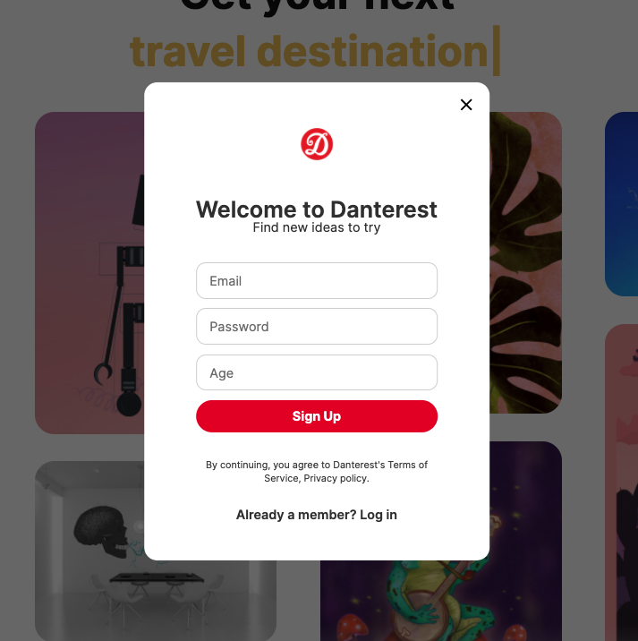
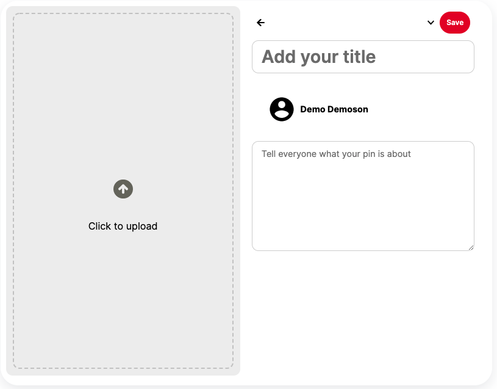
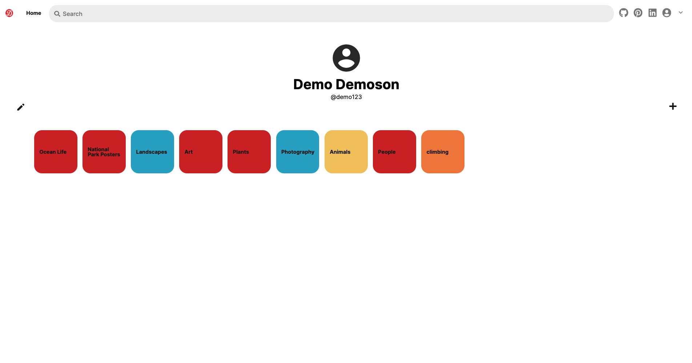

# Danterest
[Danterest](https://danterestt.herokuapp.com/#/) is a web-based app for browsing, uploading, saving, and sorting photos called 'pins' into custom 'boards' based on interests.

## Demo:
The live working demo can be found here:
### [Danterest](https://danterestt.herokuapp.com/#/)

## Site:
### Splash Page
The splash page allows users to sign-in or create a new account. Errors will be rendered if the email is already taken or if the password is too short.

### Signup Modal
The signup modal allows users to login to their account. Errors will render if the user enters incorrect login information.

### Signin Modal
The signup modal allows users to login to their account. Errors will render if the user enters incorrect login information.

### Home Page
The home page of Danterest includes an assortment of pins that users can click on and explore, a navigation bar where users can navigate to their profiles,
a sign out button, a search bar, and a home button.

### Create Pin
The create pin page allows users to upload a photo and a description that will be visible to anyone. The user can also update their pin if they choose by clicking
the dropdown menu from the three dots.

### User Page
The user page is where one place where users can create pins and boards, as well as access them. The User Page is also where users can edit their profile information.

